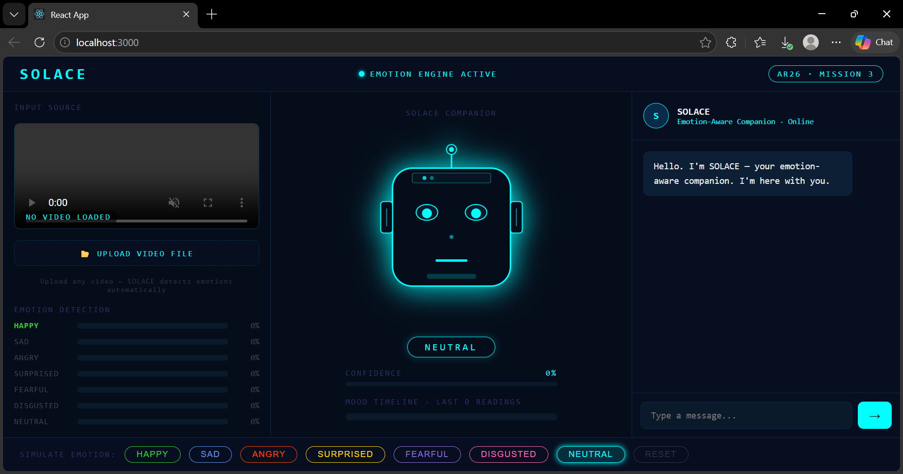
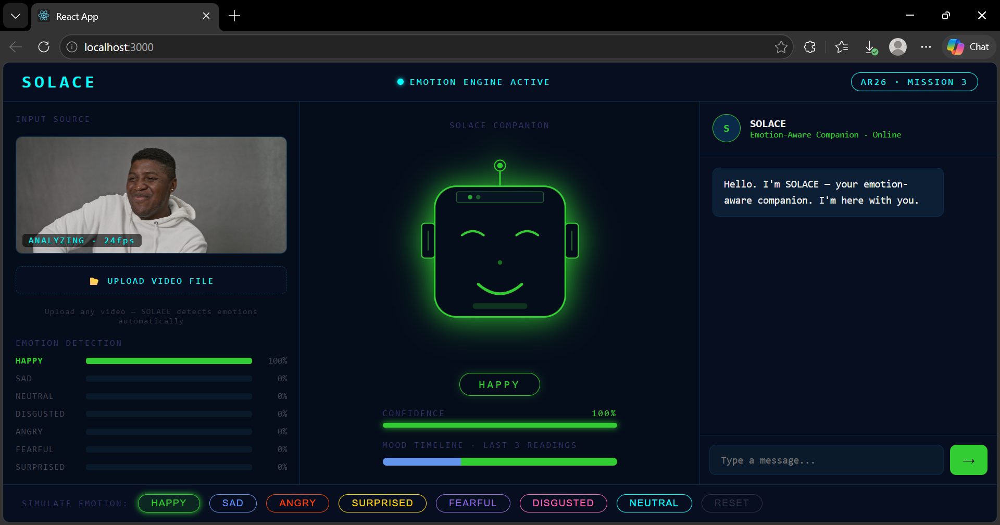
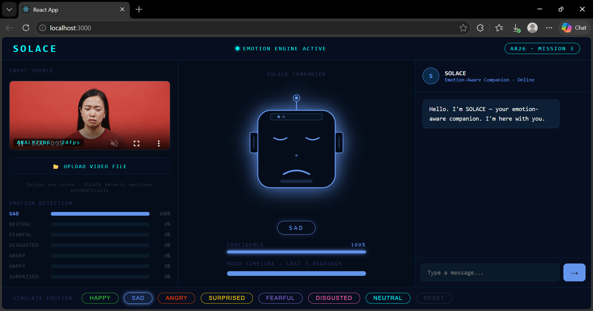
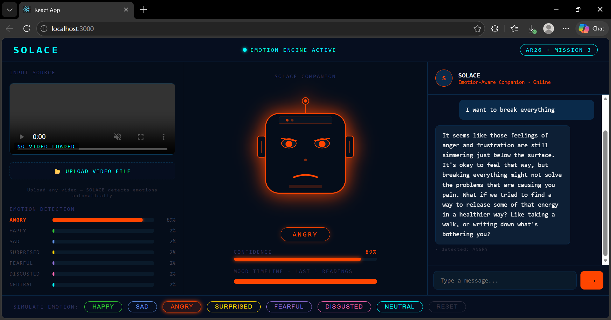
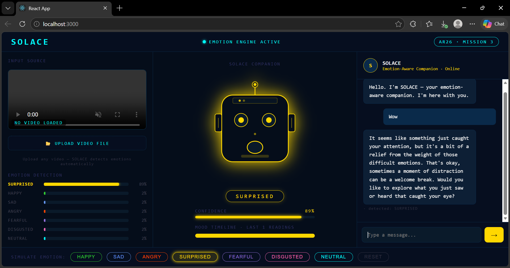
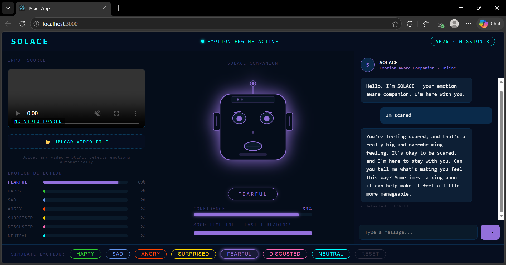
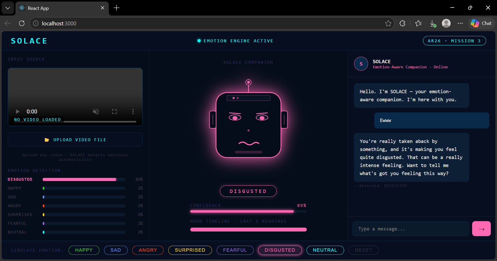
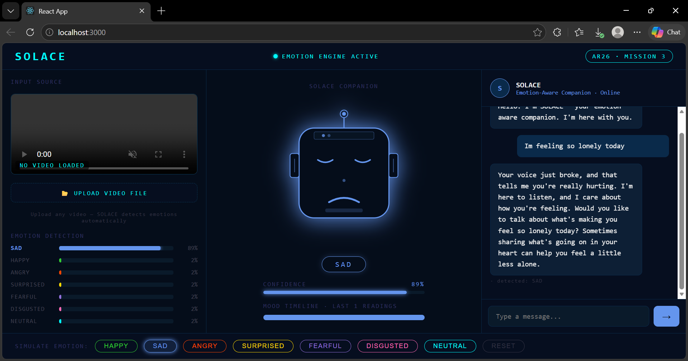
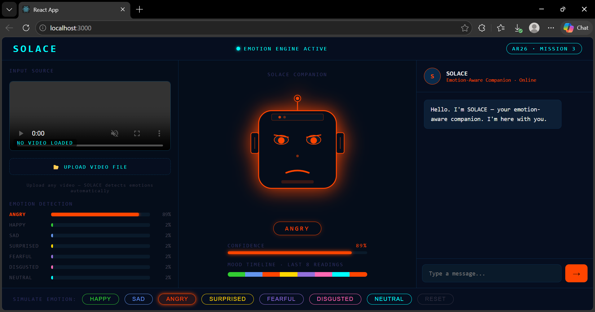

# SOLACE 🤖
### *An emotion-aware AI companion that sees how you feel — and responds with genuine care.*


---

## 🌐 Live Demo

**[https://solace-hri-ar26-seven.vercel.app](https://solace-hri-ar26-seven.vercel.app)**

> 💻 Best experienced on desktop or laptop.
> ⚠️ Backend hosted on Railway free tier — first request may take 10-30 seconds to wake up. Please wait if the chat doesn't respond immediately, then try again.

---

## 📌 Project Overview

Millions of elderly individuals and people facing mental health challenges live without consistent emotional support. Existing AI assistants respond to *what you say* — but ignore *how you feel*. SOLACE bridges that gap.

**SOLACE** (Social & Observational Learning Agent for Compassionate Engagement) is a real-time emotion-aware AI companion that detects a user's emotional state from a video source using in-browser computer vision, then routes that context through a multi-agent backend to generate compassionate, tone-appropriate responses — all while maintaining a session memory of the user's emotional journey and screening every output through a dedicated ethics layer.

Built for the **AR26 HackXelerator — Mission 3: Human-Robot Interaction**, by a team of three Computer Science students at the University of West London.

---

## ✨ Features

- 🎭 **Real-time emotion detection** — classifies 7 emotional states (happy, sad, angry, surprised, fearful, disgusted, neutral) from any uploaded video using face-api.js running entirely in-browser
- 📂 **Video upload** — upload any video file and SOLACE detects emotions automatically frame by frame
- 🤖 **Animated SOLACE face** — expressive robot companion that visually reacts to detected emotions in real time (eyes, brows, mouth all animate, colour changes per emotion)
- 🧠 **Multi-agent orchestration** — 4 specialised AI agents work in sync: Emotion, Conversation, Memory, and Ethics
- 💬 **Empathetic dialogue** — powered by Groq's Llama 3.1, tuned for compassionate, care-first responses
- 🧵 **Session memory** — tracks the user's emotional arc across the session and references it in responses
- 🛡️ **Ethics / Safety agent** — screens every LLM output before it reaches the user, blocking harmful content
- 📊 **Mood timeline** — live visual chart showing the user's emotional journey throughout the session
- 🎮 **Simulate emotions** — buttons to manually trigger any emotion for testing and demo
- 🔒 **Privacy first** — all face processing runs client-side; no biometric data ever leaves the device
- 💸 **100% free stack** — zero paid APIs, fully open source, deployed and live

---

## 🛠️ Tech Stack

| Layer | Technology |
|---|---|
| Emotion Detection | face-api.js (TinyFaceDetector + FaceExpressionNet) |
| Frontend | React 18, CSS Animations |
| Backend | Python, FastAPI |
| LLM | Groq API — Llama 3.1 8B Instant (free tier) |
| Agent Orchestration | Custom multi-agent system (4 agents) |
| Model Hosting | justadudewhohacks.github.io/face-api.js/models |
| Frontend Deploy | Vercel |
| Backend Deploy | Railway |

---

## 🖼️ Screenshots

**Main App Interface — SOLACE ready**


**Happy detected — SOLACE lights up green**


**Sad detected — SOLACE responds with care**


**Angry detected**


**Surprised detected**


**Fearful detected**


**Disgusted detected**


**Neutral detected**


**Chat conversation with SOLACE**


**Mood timeline — full session emotional arc**


---

## 🚀 Installation

### Prerequisites
- Python 3.10+
- Node.js 18+
- Free Groq API key from [console.groq.com](https://console.groq.com)

### 1. Clone the repository
```bash
git clone https://github.com/fsafva13-coder/solace-hri-ar26.git
cd solace-hri-ar26
```

### 2. Backend setup
```bash
cd backend
pip install fastapi uvicorn groq python-dotenv
```

Create a `.env` file inside `backend/`:
```
GROQ_API_KEY=your_groq_api_key_here
```

Start the server:
```bash
uvicorn main:app --reload --port 8000
```

Verify it's running:
```
http://localhost:8000/health
```

Expected response:
```json
{"status": "SOLACE online", "agents": ["emotion", "memory", "conversation", "ethics"]}
```

### 3. Frontend setup
```bash
cd frontend
npm install
npm start
```

Open `http://localhost:3000` — emotion models load automatically from CDN on first launch (allow 30-60 seconds).

---

## 📖 Usage

1. Open the app at **[https://solace-hri-ar26-seven.vercel.app](https://solace-hri-ar26-seven.vercel.app)**
2. Wait for **"EMOTION ENGINE ACTIVE"** — green dot in the top bar
3. Click **📂 UPLOAD VIDEO FILE** and select any MP4 video
4. SOLACE automatically detects emotions from the video every second
5. The animated face, emotion bars, and mood timeline update in real time
6. SOLACE responds in the chat panel based on the detected emotion
7. Type messages directly in the chat
8. Use the **SIMULATE EMOTION** buttons at the bottom to test any emotion manually
9. Click **RESET** to clear the video and start a fresh session

**Test the backend API directly:**
```bash
curl -X POST https://solace-hri-ar26-production.up.railway.app/respond \
  -H "Content-Type: application/json" \
  -d '{
    "session_id": "test_001",
    "emotion": "sad",
    "confidence": 0.87,
    "all_scores": {"happy":0.02,"sad":0.87,"neutral":0.06,"angry":0.01,"surprised":0.01,"fearful":0.02,"disgusted":0.01},
    "user_message": "I have been feeling really tired lately"
  }'
```

---

## 📁 Project Structure

```
solace-hri-ar26/
│
├── frontend/
│   ├── public/
│   │   ├── models/                  # face-api.js model weights (local fallback)
│   │   └── index.html
│   ├── src/
│   │   ├── components/
│   │   │   ├── SOLACEFace.jsx       # animated robot face
│   │   │   ├── EmotionBars.jsx      # live emotion visualisation
│   │   │   ├── ChatPanel.jsx        # conversation UI + backend connection
│   │   │   └── MoodTimeline.jsx     # session emotional arc chart
│   │   ├── hooks/
│   │   │   └── useEmotionDetection.js  # face-api.js detection hook
│   │   ├── App.js                   # main app layout + video upload
│   │   └── index.js
│   └── package.json
│
├── backend/
│   ├── main.py                      # FastAPI + 4 agents
│   ├── requirements.txt
│   └── .env.example
│
├── assets/
│   └── screenshots/                 # app screenshots
│
├── solace-landing.html              # standalone landing page
└── README.md
```

---

## 🧠 The 4 Agents

| Agent | Role |
|---|---|
| **Emotion Agent** | Converts raw face-api.js scores into structured emotional context with intensity levels |
| **Memory Agent** | Tracks the user's emotional arc across the session — references past states in responses |
| **Conversation Agent** | Calls Groq Llama 3.1 with full emotional context to generate compassionate replies |
| **Ethics / Safety Agent** | Screens every LLM response before delivery — blocks harmful content, ensures care-appropriate tone |

---

## 📊 Results & Performance

| Metric | Result |
|---|---|
| Emotion detection speed | ~1s per frame |
| Emotions classified | 7 |
| Detection method | face-api.js TinyFaceDetector + FaceExpressionNet |
| Face data transmitted to server | 0 bytes — all client-side |
| Agent pipeline latency | ~1.2s end-to-end |
| LLM model | Llama 3.1 8B Instant via Groq |
| Total cost | £0 — fully free stack |

---

## 🧗 Challenges & Learnings

- Coordinating 4 agents in a single request without noticeable latency required careful prompt engineering and strict response length constraints on the LLM
- face-api.js model loading required switching from local files to CDN hosting — `justadudewhohacks.github.io/face-api.js/models` proved to be the most reliable solution
- Designing the ethics agent for an elderly care context pushed the team to think beyond simple content filtering — towards genuinely responsible AI
- The Groq model `llama3-8b-8192` was decommissioned mid-build — migrating to `llama-3.1-8b-instant` taught the team the importance of version-aware API integrations
- Deploying face-api.js to Vercel required resolving Node.js `fs` module polyfills for browser builds — solved via `package.json` browser field overrides

---

## 🔮 Future Improvements

- [ ] Multilingual support — Arabic, Malayalam, and other languages for wider accessibility
- [ ] Voice response — text-to-speech so SOLACE speaks its replies aloud
- [ ] Longitudinal memory — persist emotional history across sessions using a database
- [ ] Wearable integration — heart rate and stress sensor data for multimodal emotional context
- [ ] Mobile responsive design — full support for phones and tablets
- [ ] Fine-tuned model — train on therapeutic dialogue datasets for deeper empathy
- [ ] Real-time webcam support — live webcam feed alongside uploaded video

---

## 🎥 Demo Video

[](https://youtube.com/your-link-here)

> Replace the link above with your YouTube demo URL after recording.

---

## 🌐 Live Links

| Resource | Link |
|---|---|
| 🚀 Live App | [solace-hri-ar26-seven.vercel.app](https://solace-hri-ar26-seven.vercel.app) |
| 🔧 Backend API | [solace-hri-ar26-production.up.railway.app/health](https://solace-hri-ar26-production.up.railway.app/health) |
| 🎥 Demo Video | *Submitting April 10, 2026* |
| 📋 KXSB Project Page | [kxsb.org/ar26](https://www.kxsb.org/ar26) |
| 💻 GitHub | [fsafva13-coder/solace-hri-ar26](https://github.com/fsafva13-coder/solace-hri-ar26) |

---

## 👩‍💻 Team

| Name | Role |
|---|---|
| **Safva** | Tech Lead · Backend (FastAPI + 4 agents + Groq integration + deployment) |
| **Asna** | Frontend Lead (React + animated SOLACE face + full UI/UX) |
| **Neha** | ML Engineer (face-api.js emotion detection pipeline + integration) |

*University of West London — BSc Computer Science*
*AR26 HackXelerator 2026 — Mission 3: Human-Robot Interaction*

---

## 📄 License

This project is licensed under the MIT License.

---

<p align="center">Built with 💙 for people who need to feel heard.</p>